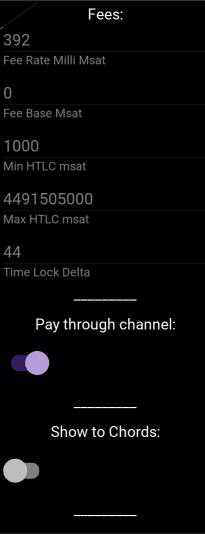
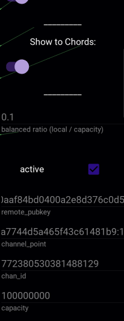

Attribute Editor
================

Channel properties can be altered via the Attribute Editor. Simply click on the peer, and the AE appears on the right-hand side.

Fees
----

``Fees``, ``Max HTLC msat`` and ``Timelock Delta`` can be altered via the AE, by modifying the value and pressing enter.

Pay Through Channel
-------------------

This specifies whether the channel is used for payments, or not. For example, you ought to switch it off for drains, since it would be difficult to re-gain outbound.

Show To Chords
--------------

We'll cover this in another section. Please ignore for now.

Balanced Ratio (local / capacity)
---------------------------------

This is the ratio at which the channel is considered to be **balanced**. For example, with a ``1 BTC`` channel, a ratio of ``0.1`` would mean the channel would be balanced once the local liquidity is ``0.1 BTC`` and the remote liquidity is ``0.9 BTC``.

This setting is used during automatic channel selection for payments and rebalancing.

Other
-----

The rest of the settings, that have not been detailed on this page are read-only. 