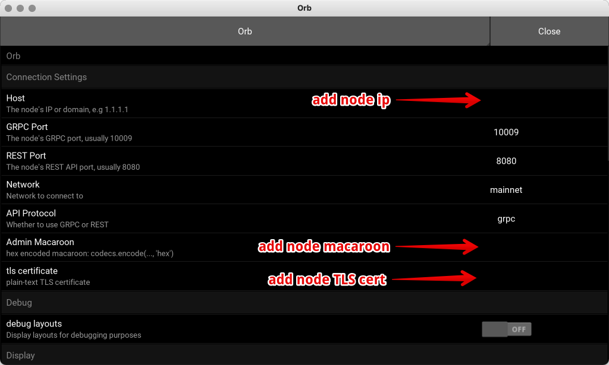

Configuring
===========

Connecting
----------

You'll need to be able to connect to your node externally to use Orb. To do so, you may need to add your node's IP to your lnd.conf, since by default, LND only serves requests on localhost.

.. code:: bash

    tlsextraip=<your_node_ip>

(please note the `tlsextraip=` line may appear multiple times).

Then restart lnd.

Firewall
--------

If you've opted for a direct connection, then on your node you'll need to open up port `10009` (or `8080` for IOS users).

.. code:: bash

    sudo ufw allow 10009
    sudo ufw allow 8080

cert and macaroon
-----------------

Encode your macaroon to hex, by running this command in your node's terminal:

.. code:: bash

    python3 -c 'import codecs; print(codecs.encode(open(".lnd/data/chain/bitcoin/mainnet/admin.macaroon", "rb").read(), "hex").decode())'

Next cat your cert:

.. code:: bash
    
    cat ~/.lnd/tls.cert

And paste those into orb.

Next change the protocol from mock to grpc.

In orb now press 'refresh' to see your channels. If this doesn't work, you may need to restart the application to pick up the new config.

App > Settings
--------------

In Orb, now click on `app > settings`, and add the following information:

Click `close` and restart Orb.