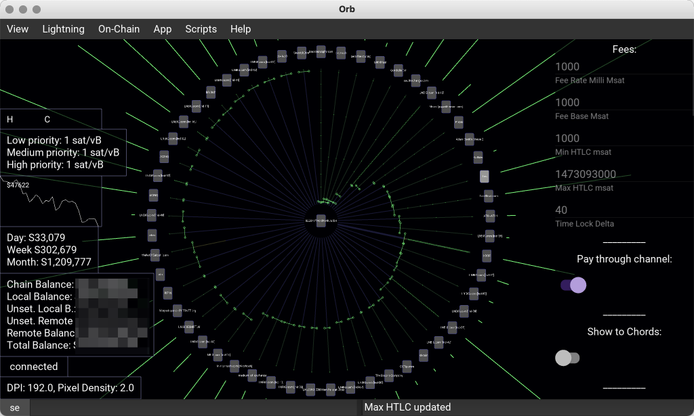

.. orb documentation master file, created by
   sphinx-quickstart on Sat Dec 11 06:30:37 2021.
   You can adapt this file completely to your liking, but it should at least
   contain the root `toctree` directive.

Orb
===

Orb is a cross-platform (Mac / Windows / OSX / Android) application for managing an LND lightning node. It features a basic IDE, and makes extending functionality, and sharing user scripts easy.

It is actively developed, maintained and used by *top 100* node operators on `lightning terminal <https://terminal.lightning.engineering>`_.

Motivation
==========

Seeing is believing
-------------------

Imagining / picturing the state of your channels and their liquidity isn't easy. Orb displays channels, peers, and their liquidity graphically and intuitively. It also displays animated HTLCs in realtime.

Reducing information overload
-----------------------------

Another issue lightning node operators face is information overload. Orb tries to display information about your node visually whenever it can.

Full node automation
--------------------

The decisions that need to be made for keeping a node balanced and profitable can be fully automated given the right ideas, and tools. Orb aims to completely take peer selection, fee setting, and rebalancing out of the operator's hands with a sophisticated set of semiand fully automated fee and rebalacing engines.

Community Scripts
-----------------

Many excellent pieces of software shine due to the scripts written and shared by their users. Orb provides an easy and well-documented way for users to write and share scripts amongst themselves.

This blurs the barrier between 'user' and 'developer' and means users can solve their own problems while sharing their solutions with one other.

Security
--------

Installing complex software stacks on your node has many (deleterious) security implications. Orb runs on your laptop or phone, and doesn't require any software to be installed on your node.

Since orb doesn't run in a web-browser, the additional risks brought on by extensions and malicious javascript is entirely obviated.

Multiplatform
-------------

Orb runs on OSX and Windows. This gives operators a familiar and mature environment in which to operate.

Orb also runs all IOS and Android. As such operators can operate their nodes while on the move.

.. toctree::
   :maxdepth: 3
   :glob:
   :caption: Contents:

   installing
   configuring
   lightning
   script_editor
   extending

Indices and tables
==================

* :ref:`genindex`
* :ref:`modindex`
* :ref:`search`
