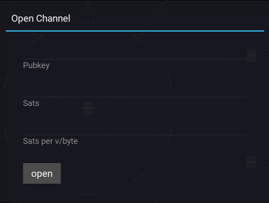

Open Channel
============

This dialog enables opening a channel with a peer. 

Pubkey
------

The Pubkey of the peer one wishes to connect to.

Sats
----

The ``local balance`` of the channel, denominated in Satoshis.

Sats per v/byte
---------------

The number of Satoshis per v/byte for the open operation. An appropriate value can be selected by refering to the Mempool HUD.
