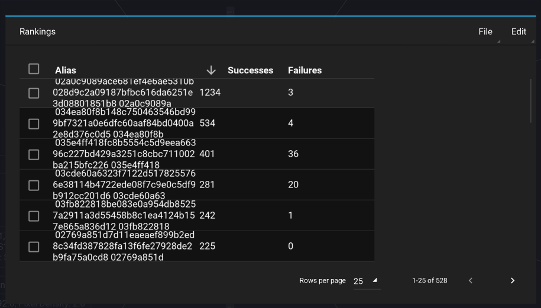

Rankings
========

The rankings dialogs displays the list of peers through which payments / rebalances were made, and is sorted by how many times the node participated in a successful payment.

Nodes with a high number of successes, and a low number of failures are good candidates to open channels with.

Importing and Exporting rankings
--------------------------------

In the rankings dialog, clicking on `File > Export DB` enables exporting the rankings database to a json file.

Clicking on `File > Ingest DB` enables importing the rankings database to a json file.

This is useful to consolidate rankings databases across multiple Orb installs, or to share rankings amongst Orb users.

Copying Pubkeys
---------------

To copy the Pubkeys of specific hosts in the Rankings dialog, simply tick their checkboxes, and click on ``Edit > Copy PKs``.