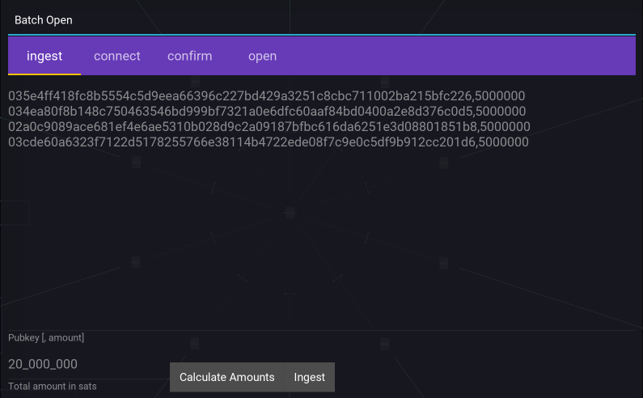

Batch Open
==========

The Batch Open dialog enables opening multiple channels at once.

.. note::

   Batch open requires an LND version >= 0.14.0.

Ingest
-------

The first step is to paste pubkeys in the main body of the dialog, then specifying a total amount, and clicking ``Calculate Amounts``. This splits the total amount evenly amongst the peers.

At this point, alterations to the amounts can be made, after which clicking on ``Ingest`` will save these amounts for the next step.

Connect
-------

The next step is to connect to those peers. This step is automated, so simply clicking on ``connect`` instructs Orb to connect top all available plain-net and tor addresses for those peers.

Confirm
-------

The penultimate confirm tab simply displays the Aliases, and amounts as a confirmation step prior to opening.

Open
----

Open instructs LND to perform the opening of those channels. The return status of the attempt is displayed in the main body of the dialog.

