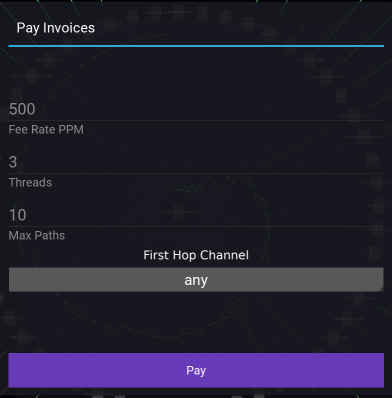

Paying Invoices
===============

Fee Rate PPM
------------

This is a straight-forward setting for the payment. e.g a ``1M`` payment would have a max fee of ``500 sats``.

Threads
-------

This should be set to ``1`` if you only intend on paying 1 invoice. If you intend to bulk-pay invoices, then ``3`` is a good number of threads. The maximum number of concurrent payment threads varies substancially based on your hardware setup.

Max Paths
---------

Making payments over lightning involves path-finding from the sender, through the network, to the destination. This setting limits the maximum number of paths attempted per payment.

It's useful to first understand the 'First Hop Channel' setting to gain a full appreciation of how "Max Paths" affects bulk-payment path-finding.

First Hop Channel
------------------

Paying invoices has two modes:

- Specifying a 'First Hop Channel' (manual)
- 'First Hop Channel' being set to 'any' (auto)

These two payment mechanism work very differently, so please read through this page carefully before attempting to make payments.

Specifying 'First Hop Channel'
------------------------------

This specifies you only intend on paying one invoice, through the specified channel. In this mode, no more than 1 thread is recommended, and setting max paths to over `100` is also recommended.

This means Orb and LND will perform an exhaustive path-finding, with the specified channel as the first hop, through the network to find a low-fee path that can carry out the payment at the desired fee rate.

'First Hop Channel' any
-----------------------

This specifies bulk payment of invoices. In other words, the payment threads will continue until all invoices are paid. The channel selection process is also automatic; i.e Orb will select which channels to use for payments based on their liquidity status and the preferences you have set for these channels. The settings use during the automated channel selection process are:

Pay through channel
~~~~~~~~~~~~~~~~~~~

This can be set or unset in the AE. Only channels with **pay through channel** set will be considered for the automated channel selection process.

Balanced ratio
~~~~~~~~~~~~~~

If making the payment through a particular channel gets it closer, and not further away from its balanced ratio, then it will be considered for automated channel selection.

--------------------------------------------------------------------------------

Max Paths and automated payments
--------------------------------

The reason `Max Paths` has a default value of 10, is because it has empirically been found to be a more optimal strategy for bulk payments through the lightning network.

What this really specifies is, that if after attempt ``10`` payment paths, the payment has still not succeeded, then Orb simply gives up paying through that channel and selects another one.

This works well because the path building uses **Mission Control** which *remembers* failed channels in the network. As such, even though the payment process gives up, if we attempt payments through the same channel later, we resume where we left off, as opposed to attemping payments through channels in the network that recently failed.

