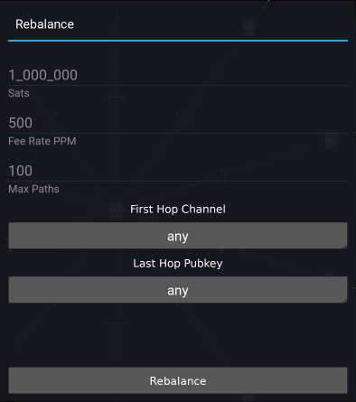

Rebalance
=========

Rebalance, although very similar to pay, only performs one rebalance at a time.

.. note::

   In a future version of Orb, it will be possible to perform multiple rebalances in one go.

Fee Rate PPM
------------

This is a straight-forward setting for the payment. e.g a ``1M`` payment would have a max fee of ``500 sats``.

First Hop Channel
-----------------

The first channel through which the rebalance takes place. If not specified, it is selected automatically according to your ``balanced / ratio`` setting.

Last Hop Pubkey
---------------

The Pubkey of the last hop for the rebalance. If not specified, it is selected automatically according to your ``balanced / ratio`` setting.

.. warning::

   LND only provides the ability to select the Pubkey for the last hop, not the channel. The implication is that if you have two channels with the same Peer, then you are unable to select specifically which channel the rebalance is received.

Max Paths
---------

The number of paths to attempt before giving up.

